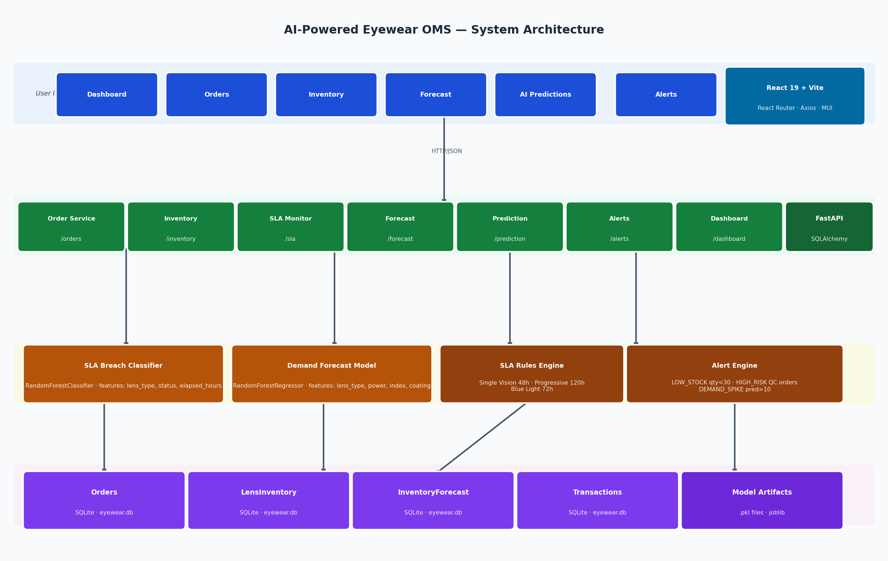
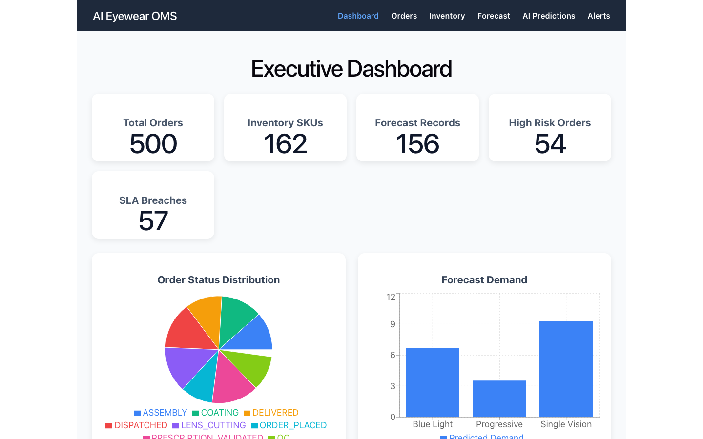
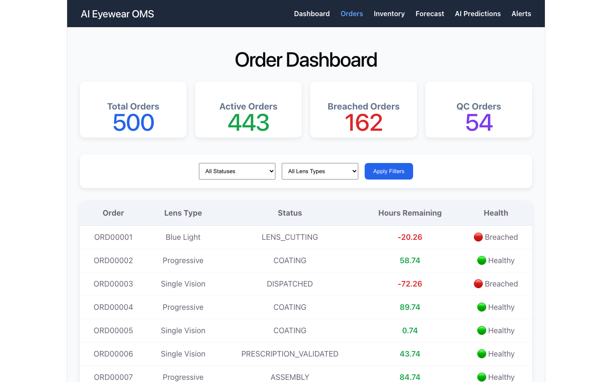
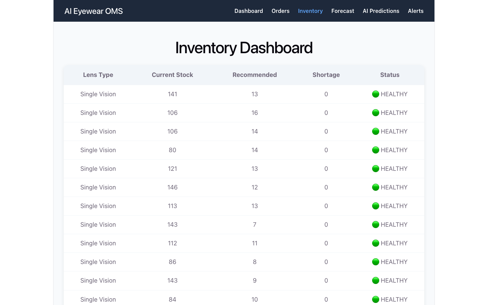

# Architecture Note — AI-Powered Eyewear OMS

## System Architecture



The system is a two-tier web application: a **React 19 SPA** communicates with a **FastAPI backend** over REST/JSON. All persistence is handled by **SQLite via SQLAlchemy**. Two offline-trained scikit-learn models are embedded directly in the backend process — no external AI API calls are made at runtime.

```
Browser (React)
    │  HTTP/JSON
    ▼
FastAPI (uvicorn)
    ├── Order, Inventory, SLA, Forecast, Prediction, Alert, Dashboard routers
    ├── breach_model.pkl  ──► predict_proba() on every /prediction request
    └── forecast_model.pkl ─► predict() on every /forecast/generate request
         │
         ▼
    SQLite (eyewear.db)
    Orders · LensInventory · InventoryForecast · InventoryTransactions · OrderStatusHistory
```

---

## AI Models Used

### 1. SLA Breach Classifier — `RandomForestClassifier`

**What it does:** Given an in-flight order, outputs a probability (0–1) that the order will breach its SLA. Used by the AI Predictions dashboard and the Alert engine.

**Why Random Forest:**
- The signal in the training data is nonlinear (breach probability jumps sharply near the SLA deadline, not gradually). Random Forest captures this without manual feature engineering.
- The dataset is small (~500 rows) and tabular. A neural network would overfit; logistic regression would miss the nonlinearity. Random Forest is the right size for this problem.
- `predict_proba()` gives calibrated probabilities, which allows bucketing into HIGH / MEDIUM / LOW risk tiers post-hoc — keeping the business thresholds easy to tune without retraining.

**Features:**
| Feature | Why included |
| --------------- | -------------------------------------- |
| `elapsed_hours` | Primary signal — 59% importance |
| `lens_type` | SLA target varies by lens type — 38% |
| `status` | Current stage affects remaining risk — 3% |

**Training:** Built from live order data via `POST /admin/train-model`. Dataset labeled using the SLA rule engine (`breached = elapsed > sla_hours`).

**Artifacts:** `app/ml/breach_model.pkl`, `lens_encoder.pkl`, `status_encoder.pkl`

---

### 2. Inventory Demand Forecast — `RandomForestRegressor`

**What it does:** Given a lens SKU (type + power + index + coating), predicts how many units will be consumed. Output drives the `recommended_stock` field (predicted × 1.30 safety buffer) on the Inventory health dashboard.

**Why Random Forest:**
- Demand per SKU is a regression target with non-obvious interactions between lens type, power, and coating — a product of 4 categorical dimensions. Random Forest handles these interactions natively.
- Unlike time-series models (ARIMA, Prophet), this model predicts demand per SKU category rather than demand over time. The dataset is structured as transaction aggregates, not a time series, so Random Forest is the correct choice.
- No hyperparameter tuning required at this scale; the default forest generalises well.

**Features:** Lens Type, Power, Lens Index, Coating (all label-encoded)

**Target:** `quantity_used` from `InventoryTransaction`

**Artifacts:** `app/ml/forecast_model.pkl`, `forecast_*_encoder.pkl`

---

### Why No External AI API?

The application intentionally avoids calls to external LLM or ML APIs (e.g. OpenAI, Claude, Vertex AI) for the core prediction features. Reasons:

1. **Latency** — Every order list render would block on a network round-trip. Embedded inference with joblib is sub-millisecond.
2. **Cost** — Calling an API per order across 500+ orders per page load would be expensive and unpredictable.
3. **Data privacy** — Order data, power prescriptions, and customer identifiers stay on-premise. No PII leaves the server.
4. **Determinism** — Embedded `.pkl` models produce identical output for the same input. External APIs may change behaviour across model versions.

An LLM integration is listed as a future enhancement for generating natural-language operational insights — that use case (summarisation, not per-order classification) is a better fit for an API call.

---

## Screenshots

### Executive Dashboard


### Order Dashboard


### Inventory Dashboard

